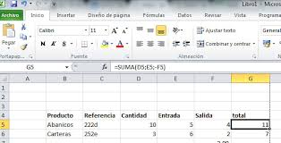

# Dominando-las-listas-en-python
ayuda

# dominando la listas en python

### el problema de las bariables
no hay que poner todo en desorden para poner el nombre de sus 30 amigos 
solicion 
: sistema de inventario 
permite agrupar y organizar multiples elementos

 

### anatomia de una lista en python

nombre de lista
ejp: amigos 
adentro de los parentesis se pone el nombre de sus amigos y puedes poner la edad de tus amigos 
ejp: clase = ["ana","luis","pedro"]                                                                                             

### agregando y eliminando 

antes tendrias 3 amigos cuando agregas 1 tienes 4 y si eliminas 1 te quedas con 3 

 

### trucos utiles 
len es para crear una lista  devuelve a la cantidad total de elementos 

lista ordena por apellidos para ponerlos en orden 

lista.reverse invierte el orden de todos los estudiantes el primero es ultim y el ultimo e primero

### super poderes 
podemos modificar la cantidad de amigos que tenemos si tenemos 1 nos añadimos 1 y asi susesiba mente 